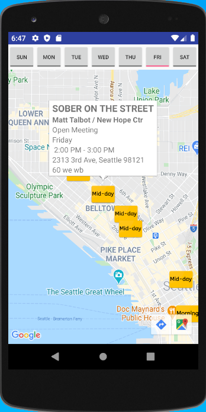

# OneMeetingAway

This Project seeks to develop an Android Application that brings convenience to the Alcoholics Anonymous Community.

This was a 4 person project with me as the team lead. The project length was 10 weeks, summer school,  and there is more we all would have liked to get done.
We created onboard SQLite database for offline use and integrated Google maps SDK for mapping. We scraped Seattle AA website for meeting information locations, and times.

Users will be able to open this app and see an array of meetings in their vicinity by using the MapView.

### Opening Screen
The app opens to a map of the users current location

### Selecting a day to attend a meeting
Once a day is selected, in this case Friday, markers show the location of the meetings and if it is in the morning, mid-day or evening meeting

### Zooming in and selecting a meeting
The users can zoom in, select a meeting, and the details for the meeting pops up.

